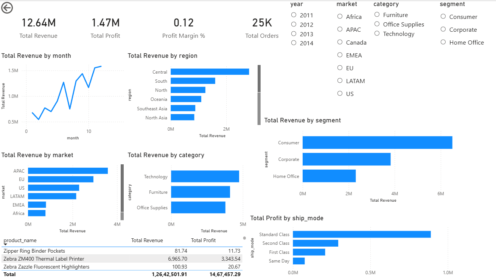
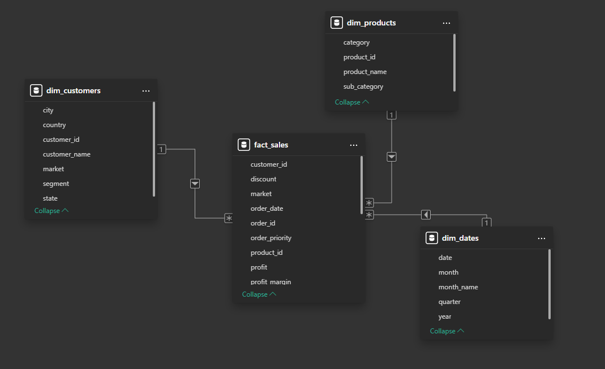
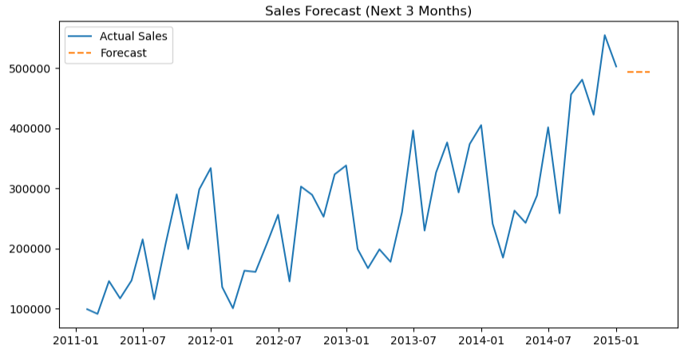

# Enterprise Sales Analytics & Forecasting Project

## 📊 Overview
An end-to-end enterprise-level sales analytics system built using Global Superstore data to analyze revenue, profitability, customer behavior, and sales trends across markets and regions.

## 🎯 Objective
- Monitor key sales KPIs such as revenue, profit, margin, and AOV
- Analyze performance across markets, regions, products, and customers
- Identify loss-making products and high-value customers
- Forecast future sales using time-series analysis

## 🧱 Data Model
- Fact Table: Sales transactions
- Dimension Tables: Customers, Products, Dates
- Star-schema based analytical design

## 🛠 Tools & Technologies
- Power BI – Data modeling, DAX, interactive dashboards
- SQL Server – KPI queries and business analytics
- Python – Pandas, Matplotlib for sales forecasting
- Excel / CSV – Data source

## 📈 Dashboard Preview

## 🧩 Star Schema Data Model

## 📉 Sales Forecast

## 🔍 Key Insights
- Consumer segment contributes the highest revenue
- Technology category is the top revenue driver
- High discounts negatively impact profit margins
- Sales show a consistent upward trend with seasonality

## 📁 Project Structure
data/        -> Clean datasets  
powerbi/     -> Power BI dashboard  
python/      -> Forecasting notebook  
sql/         -> SQL analytics queries  
screenshots/ -> Dashboard visuals  
